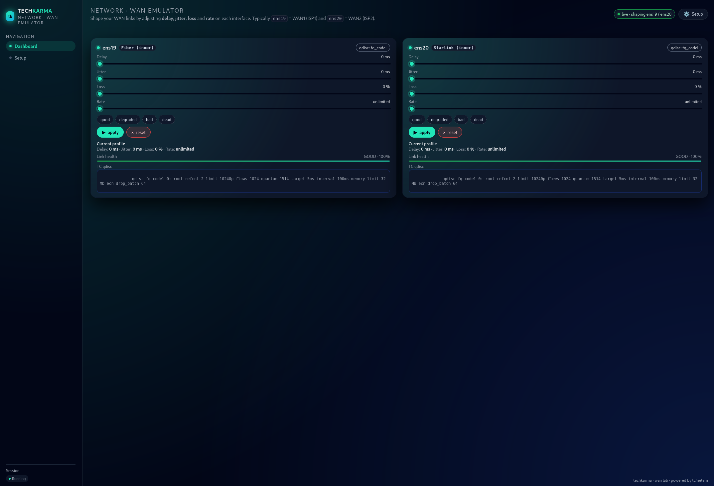
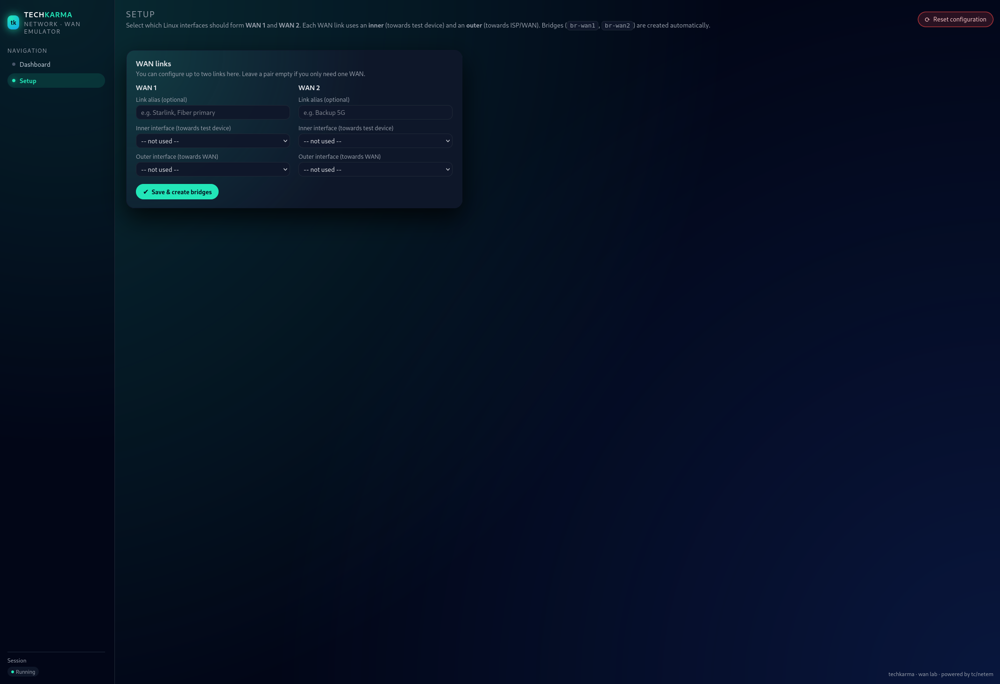

# Techkarma NetEm

**Techkarma NetEm** is a modern, browser‑based WAN emulator built on top of Linux `tc/netem`.  
It lets you shape **latency, jitter, packet loss, and bandwidth** across transparent L2 bridges —
perfect for testing **firewalls, SD‑WAN units, routers, Starlink behaviour, 4G/5G, IPS systems, failover logic**, and more.

This project is open‑core:  
- **Free open-source edition** (this repository)  
- **Paid OVA appliance** --- prebuilt Debian VM (ready-to-run)

➡ Official site: **https://techkarma.no/**
➡ Quickstart Guide: **GUIDE.md**\
➡ OVA Appliance: **https://buymeacoffee.com/techkarma/extras**

---

# Features

### Two independent WAN links  
Each WAN link uses:
- **Inner interface** → toward your test device (FW/SD‑WAN/router)
- **Outer interface** → toward upstream/ISP side  
Bridges (`br-wan1`, `br-wan2`) are created automatically.

### GUI-based shaping  
Clean UI with sliders for:
- Delay (ms)  
- Jitter (ms)  
- Packet loss (%)  
- Bandwidth limit (Mbit/s)

### Link Aliases  
Give each WAN link a friendly name:  
`Fiber primary`, `Starlink`, `5G backup`, etc.

### Powered by Linux NetEm  
Under the hood:
- `tc qdisc netem` for latency/jitter/loss  
- `tbf` (token bucket filter) for bandwidth  
- Linux bridges for transparent forwarding  

### Designed for real labs  
Optimized for:
- Fortinet  
- Cisco  
- Juniper  
- Palo Alto  
- SD‑WAN platforms  
- Starlink testing  
- Failover tuning  
- IPS/IDS behaviour analysis  

---

# Screenshots

### **Dashboard**


### **Setup Wizard**


---

# Architecture

```
        +----------------------+
        |  Test Device (FW)    |
        +----------+-----------+
                   |
               (inner NIC)
                   |
         +---------+----------+
         |   Techkarma NetEm  |
         |     br-wan1        |
         |   tc/netem+tbf     |
         +---------+----------+
                   |
               (outer NIC)
                   |
        +----------+-----------+
        |   Upstream Router    |
        +----------------------+
```

2 bridges = 2 independent WAN paths.

---

# Installation (Debian 12 Recommended)

## 1. Install dependencies

```bash
sudo apt update
sudo apt install -y python3 python3-venv python3-pip iproute2 bridge-utils git
```

## 2. Clone the repo

```bash
cd /opt
sudo git clone https://github.com/techkarma-no/techkarma-netem.git
sudo chown -R $USER:$USER techkarma-netem
cd techkarma-netem
```

## 3. Create a virtualenv

```bash
python3 -m venv .venv
source .venv/bin/activate
pip install flask
```

## 4. Run manually (development mode)

```bash
FLASK_APP=app.py python app.py
```

Then open:

```
http://<vm-ip>:8081/
```

You will see the **Setup** screen on first launch.

---

# Systemd Service (Recommended)

## 1. Create `.venv` (if not already)

```bash
cd /opt/techkarma-netem
python3 -m venv .venv
source .venv/bin/activate
pip install flask
deactivate
```

## 2. Create systemd unit

File: `/etc/systemd/system/techkarma-netem.service`

```ini
[Unit]
Description=Techkarma NetEm - WAN Emulator UI
After=network-online.target
Wants=network-online.target

[Service]
Type=simple
WorkingDirectory=/opt/techkarma-netem
ExecStart=/opt/techkarma-netem/.venv/bin/python app.py
User=techkarma
Group=techkarma
Restart=on-failure
RestartSec=3

[Install]
WantedBy=multi-user.target
```

## 3. Enable the service

```bash
sudo systemctl daemon-reload
sudo systemctl enable techkarma-netem
sudo systemctl start techkarma-netem
sudo systemctl status techkarma-netem
```

---

# First-Time Setup

1. Go to `http://<vm-ip>:8081/setup`
2. Assign:
   - WAN1 alias  
   - WAN1 inner  
   - WAN1 outer  
3. Optionally repeat for WAN2  
4. Save – bridges are created automatically  
5. Open **Dashboard**

Your links are now live.

---

# How It Works (Under the Hood)

Each WAN link is implemented as:

```
br-wanX
   |-- inner NIC (towards firewall/test device)
   |-- outer NIC (towards WAN/upstream)
```

Traffic is shaped on the **inner NIC** via:

- `tc qdisc add dev <nic> root netem delay ... jitter ... loss ...`
- `tc qdisc add dev <nic> parent 1:1 tbf rate ...`

Clearing shaping:

```bash
tc qdisc del dev <nic> root
```

---

# Use Cases

### SD‑WAN Failover
Emulate:
- Bad LTE  
- Moderate Starlink  
- Weak backup radio  
Trigger realistic failover behavior.

### Starlink Behavior
Reproduce:
- Latency spikes  
- Temporary packet loss  
- Saturation under load  

### IPS/Firewall Performance
Test how your NGFW behaves under real-world poor WAN conditions.

---

# Troubleshooting

### “No qdisc visible”
Run:
```bash
which tc
tc qdisc show dev <nic>
```

### Bridges not created
Make sure no conflicting names exist:
```bash
brctl show
ip link show
```

### UI not loading
Check:
```bash
sudo systemctl status techkarma-netem
sudo ss -ltnp | grep 8081
```

---

# Roadmap

- Multiple WAN links (more than 2)
- Profile presets
- API for automation
- Automatic Starlink-behavior presets
- Import/export config
- Authentication for GUI
- Built‑in package installer

---

# OVA Appliance Edition (Paid Edition)

A ready-to-use VM image for: - Proxmox\
- VMware ESXi\
- VMware Workstation\
- VirtualBox\
- XCP-NG

Includes: - Debian preconfigured\
- Techkarma NetEm preinstalled\
- Web UI running automatically\
- Forced password change on first boot

Buy & auto-download:\
https://buymeacoffee.com/techkarma/extras

---

# Contributing

PRs, issues and feature requests welcome.  
Please open GitHub issues before large contributions.

---

# License

MIT License – see `LICENSE`.

---

Made by techkarma  
for people who need real WAN behavior in their labs.
